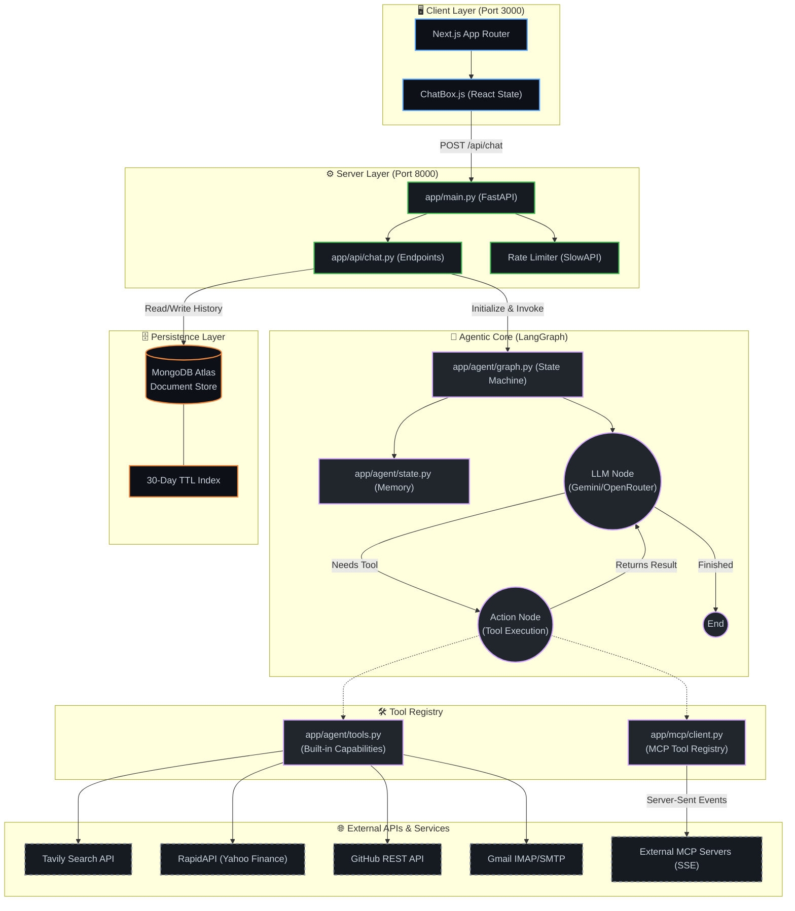

<div align="center">

<!-- Animated Header -->


<br/>

[](https://agentic-mcp-chatbot.onrender.com)
[](https://ambuj-ai-portfolio.vercel.app/)

<br/>

[](https://python.org)
[](https://fastapi.tiangolo.com)
[](https://nextjs.org/)
[](https://langchain-ai.github.io/langgraph/)
[](https://modelcontextprotocol.io)
[](https://docker.com)

</div>

---

## ⚡ What Is This?

A **production-grade Agentic AI Workspace** built around a powerful LangGraph ReAct agent. This platform features a custom-engineered **Model Context Protocol (MCP)** integration layer, enabling the agent to autonomously discover, register, and execute external tools over SSE transport — without requiring application code changes.

Unlike standard LLM chatbots, this system **thinks before acting**, orchestrating 12+ real-world APIs (GitHub, Gmail, Finance, Web Search) and employing strict **Human-in-the-Loop (HITL)** approvals before executing sensitive real-world actions like sending emails.

---

## 🏗️ System Architecture

<div align="center">
<br/>



<br/>
</div>

---

## 🧠 Core Agent Capabilities

| Capability | Description |
|------------|-------------|
| **MCP Tool Orchestration** | Dynamically loads and connects to external MCP servers (e.g., SQLite, GitHub) using `sse_client`. |
| **ReAct Reasoning** | Autonomous `Think → Act → Observe` loop orchestrated via LangGraph `add_messages` state reducers. |
| **Real-time SSE Streaming** | Token-by-token streaming of the LLM's thought process directly to the Next.js UI. |
| **Human-in-the-Loop (HITL)** | Intercepts sensitive AI actions (e.g., SMTP dispatch) requiring explicit human approval via the UI. |
| **Persistent Sliding Memory** | Thread-isolated MongoDB conversation history with automatic 30-day TTL cleanup. |

---

## 🛠️ The 12+ Integrated Tools Ecosystem

1. **GitHub Analytics (REST API):** Fetch repos, user stats, commit history.
2. **Gmail Operations (SMTP/IMAP):** Read inbox, analyze threads, and draft semantic replies.
3. **Web Search (Tavily):** Real-time, grounded AI internet browsing.
4. **Financial Data (Yahoo Finance/RapidAPI):** Fetch real-time market data and historical stock charts.
5. **Generative UI Rendering:** Recharts-driven real-time dynamic visualizations.
6. **System Utilities:** Weather, Calculator, Datetime, and more.

---

## 🔧 Tech Stack

<table>
<tr>
<td><b>Category</b></td>
<td><b>Technology</b></td>
<td><b>Purpose</b></td>
</tr>
<tr>
<td rowspan="3"><b>Agent & AI Layer</b></td>
<td>LangGraph</td>
<td>Stateful, cyclic multi-agent orchestration (ReAct Pattern)</td>
</tr>
<tr>
<td>Model Context Protocol (MCP)</td>
<td>Standardized, plug-and-play tool server discovery via SSE</td>
</tr>
<tr>
<td>OpenRouter / Gemini</td>
<td>Multi-model routing (Qwen, Llama 3, DeepSeek, Gemini Pro)</td>
</tr>
<tr>
<td rowspan="2"><b>Backend</b></td>
<td>FastAPI + Uvicorn</td>
<td>Async REST API handling SSE streaming and graph execution</td>
</tr>
<tr>
<td>Python 3.11</td>
<td>Core backend logic and tool integration</td>
</tr>
<tr>
<td rowspan="2"><b>Frontend</b></td>
<td>Next.js 14</td>
<td>React Framework for production-grade UI</td>
</tr>
<tr>
<td>Tailwind CSS / Lucide Icons</td>
<td>Modern, responsive, glassmorphism UI design</td>
</tr>
<tr>
<td rowspan="2"><b>Data & Observability</b></td>
<td>MongoDB Atlas</td>
<td>High-performance cloud storage for chat histories (TTL indexing)</td>
</tr>
<tr>
<td>LangSmith</td>
<td>Tracing LCEL execution, token cost tracking, and debugging</td>
</tr>
<tr>
<td rowspan="2"><b>Deployment</b></td>
<td>Docker (Multi-stage)</td>
<td>Combined Frontend + Backend containerization</td>
</tr>
<tr>
<td>Render</td>
<td>Cloud deployment optimized for 512MB RAM constraints</td>
</tr>
</table>

---

## 🚀 Quick Start (Local Setup)

### Prerequisites
- Node.js 18+
- Python 3.11+
- API Keys: OpenRouter/Gemini, MongoDB Atlas, Tavily, RapidAPI, Gmail App Password

### 1. Clone the repository
```bash
git clone https://github.com/Ambuj123-lab/agentic-mcp-chatbot.git
cd agentic-mcp-chatbot
```

### 2. Backend Setup
```bash
python -m venv venv
# Windows: venv\Scripts\activate
# Mac/Linux: source venv/bin/activate

pip install -r requirements.txt
cp .env.example .env  # Fill in your API keys!

uvicorn app.main:app --reload --port 8000
```

### 3. Frontend Setup (New Terminal)
```bash
cd frontend
npm install
npm run dev
```
Visit `http://localhost:3000` to interact with the workspace!

---

## 🐳 Docker Deployment (Production)

This project uses a highly optimized **Multi-Stage Dockerfile**. It first builds the Next.js static site, then serves it directly through FastAPI alongside the API endpoints, running perfectly on a single Render Web Service.

```bash
docker build -t agentic-mcp-workspace .
docker run -p 8000:8000 --env-file .env agentic-mcp-workspace
```

---

## 🌐 Live Links

| Resource | URL |
|----------|-----|
| **🚀 Live Application** | [Deploying Soon to Render](#) |
| **👤 Ambuj's Portfolio** | [ambuj-ai-portfolio.vercel.app](https://ambuj-ai-portfolio.vercel.app/) |
| **📖 Financial Parser Docs** | [ambuj-rag-docs.netlify.app](https://ambuj-rag-docs.netlify.app/) |
| **💻 Source Code** | [GitHub Repository](https://github.com/Ambuj123-lab/agentic-mcp-chatbot) |

---

## 👨‍💻 Author

**Ambuj Kumar Tripathi**  
GenAI Engineer & RAG Systems Specialist | LLMOps

[](https://www.linkedin.com/in/ambuj-kumar-tripathi/)
[](https://github.com/Ambuj123-lab)
[](https://ambuj-ai-portfolio.vercel.app/)

---

<div align="center">


<sub>Built with 🧠 LangGraph • 🔌 MCP • ⚡ FastAPI • ⚛️ Next.js 14 • 🍃 MongoDB</sub>

</div>
